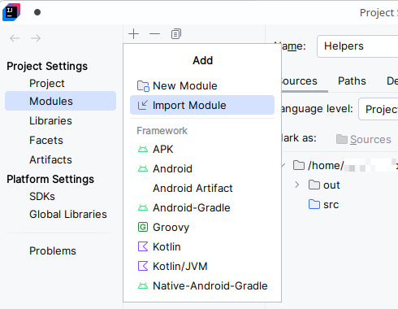

# Java text menu and input helper classes

* In your code, `import Helpers` to use the helper classes.

## SafeInput class

To use this class, create an instance

### The `getValue` method

### The `getValueWithLimits` method

## MenuBuilder class

To use this class, create an instance in one of 2 ways

## TextMenu class

### The `menu` method
```Java 
public static int menu (String header, String options);
```

### The `menuLoop` method

### The `listMenuLoop` method

### The `yesNoQuestion` method


## Adding Helpers to your project in IntelliJ IDEA

* In the menu, go to **File** → **Project Structure**
* In the Project Structure dialog, select **Modules**, the click **+** in the list of modules, then select **Import Module**



* In the next dialog, pick the path to the cloned ***Helpers*** repository and click **OK**


* In the next dialog, select **Create module from existing sources** and click **Next**


* In the following dialogs, confirm that everything is correct
* After you have **Helpers** module added to your project, close the **Project Structure** dialog


